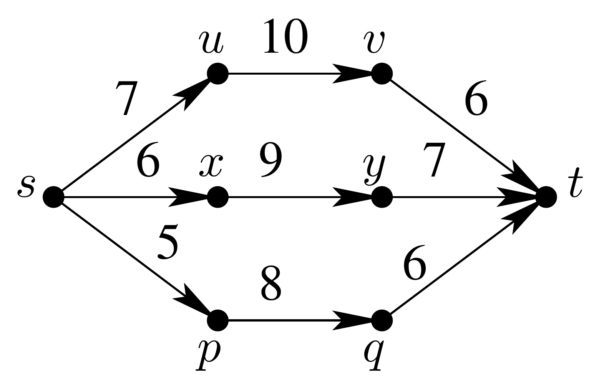

# MC558 2021s1 - Teste 3

- [Enunciado](enunciado.pdf).
- ~~Entrega~~.

## Item 1 - *(25 pontos)*

Professor Sabit Udo propôs um novo algoritmo para resolver o Problema da Árvore Geradora Mı́nima para **grafos completos ponderados**. Assim, o algoritmo supõe que a entrada é um grafo não-orientado **completo** ponderado (G,ω). Uma **partição balanceada** de V é uma partição de V em dois subconjuntos V₁, V₂ tais que |V₁| e |V₂| diferem de no máximo uma unidade (ou seja, se |V| for par, V₁ e V₂ têm o mesmo tamanho, senão um deles tem tamanho ⌊|V|/2⌋ e o outro ⌊|V|/2⌋+1. Eis o pseudocódigo do algoritmo em alto nı́vel.

```raw
Talvez-AGM(G, ω) ⊲ G é completo
1 se |V[G]| ≤ 2 então devolva G
2 seja V1 , V2 qualquer partição balanceada de V[G]
3 seja Gi o subgrafo completo de G contendo apenas os vértices de Vi e todas as arestas
    de G ligando vértices de Vi para i = 1, 2
4 seja ωi a restrição de ω a Gi para i = 1, 2
5 T1 ← Talvez-AGM(G1, ω1)
6 T2 ← Talvez-AGM(G2, ω2)
7 seja e uma aresta de peso mı́nimo no corte (V1, V2) em G
8 devolva T1 ∪ T2 ∪ {e}
```

Prove que o algoritmo Talvez-AGM funciona ou mostre um contra-exemplo. **Justifique.**

## Item 2 - *(75 pontos)*

A Comissão de Estudo dos Transportes (CET) recebeu a tarefa de analisar o custo de viagem (em termos de pagamento de pedágios) de uma cidade *s* a uma cidade *t*. Uma viagem de *s* a *t* deve passar por vários trechos com pedágios. Através de um estudo estatı́stico ela concluiu que um motorista tı́pico que vai de *s* para *t* está disposto a pagar no máximo *k* reais no total. A CET gostaria de saber qual é a rota de *s* para *t* na qual o motorista tem que pagar o maior pedágio (em um trecho), com a restrição de que o custo total seja no máximo *k*.

Mais precisamente, a CET tem um grafo orientado ponderado *(G,ω)* que representa a rede rodoviária em que cada vértice representa uma cidade, uma aresta *(u,v)* representa uma estrada de *u* para *v* e o peso *ω(u,v)* é o valor do pedágio naquela estrada. O **preço** de um caminho *P* é peso da aresta mais pesada em *P* (i.e., o maior preço que deve-se pagar nesta rota). Dado *k*, a CET quer saber dentre todos os possı́veis caminhos de *s* a *t* com peso total no máximo *k*, qual tem o maior preço.

### Exemplo

Considere o grafo da figura abaixo e suponha que *k = 22*.



- O caminho *(s, u, v, t)* tem peso total 7 + 10 + 6 = 23 > k e não deve ser considerado.

- O caminho *(s, x, y, t)* tem peso total 6 + 9 + 7 = 22 ≤ k e o preço é 9.

- O caminho *(s, p, q, t)* tem peso total 5 + 8 + 6 = 19 ≤ k e o preço é 8.

Neste caso, a resposta é 9.

### Observação

O caminho de maior preço não precisa ser simples.

### Hipóteses

1. Nesta questão, todos os grafos são e devem ser representados por listas de adjacências. Além, não têm arestas de peso negativo.

2. Você tem à disposição um algoritmo chamado Dijkstra que dado um grafo orientado ponderado *(G,ω)* e um vértice *s ∈ V[G]*, devolve um vetor *d[ ]* indexado por *V[G]* tal que *d[v] = dist(s,v)* para todo *v ∈ V[G]*. Este algoritmo é dado como uma **caixa-preta**, i.e., você não sabe como ele é implementado internamente.

3. Suponha que Dijkstra tem complexidade de tempo *O(f(V+E))* (uma função de V e E). A complexidade exata não é importante, mas deve ser respeitada na solução (veja abaixo).

### O que a questão pede?

Dada um grafo *(G,ω)*, *s*, *t ∈ V[G]* e um valor *k > 0*, mostre como usar Dijkstra para determinar o maior preço entre todos os caminhos de *s* a *t* de peso total no máximo *k*. Explique sua ideia **sucintamente** e escreva um pseudo-código para seu algoritmo. Você não precisa provar que o algoritmo está correto, mas sua explicação deve ser clara o suficiente para eu me convencer disto. A complexidade do seu algoritmo deve ser *O(V+E + f(V+E))*. Note que você não precisa devolver o caminho, apenas o preço dele.

### Observações

- Soluções que “modificam” o Dijkstra ou usam outro algoritmo de caminhos mı́nimos receberão nota ZERO. Você deve usar o algoritmo como especificado.

- Soluções que não atendem à complexidade de tempo exigida serão consideradas erradas (a nota vai depender do que foi feito).

- Você pode usar uma mistura de português e algoritmês para descrever o pseudo-código.

- Você pode modificar o grafo ou construir outros grafos para serem usados como entrada do Dijkstra.

- Você pode usar resultados ou algoritmos vistos em aula ou nas listas de exercı́cios, excluindo os da primeira observação.

- A nota levará em conta a qualidade de sua explicação (25 pontos).


## Instruções:

1. As respostas devem ser digitadas usando qualquer editor/formatador (sugiro LATEX, se você souber usar). As submissões devem ser feitas em formato pdf no Google Classroom; você pode anexar figuras, mas gere um único arquivo. Soluções que não respeitem estas condições receberão **nota ZERO**.

2. Todas as respostas devem ter justificativas (corretude e/ou complexidade), a menos que a questão diga explicitamente que não são necessárias.

3. Você pode usar qualquer resultado ou algoritmo visto em aula. Conforme o caso, enuncie o resultado ou escreva qual é a complexidade do algoritmo, caso seja necessário na análise de complexidade.

4. Em qualquer questão que exija um pseudo-código complicado, explique sua ideia antes de escrevê-lo (no máximo uma página, mas isto provavelmente é muito dependendo da questão). Outra forma é você explicar em alto nı́vel o que faz cada trecho de código.
Sua explicação deve ser boa o suficiente para me convencer que o algoritmo funciona (inclua provas de resultados auxiliares, se necessário). Note que explicar bem não é o mesmo que explicar muito. Soluções que tenham pseudo-códigos complicados, mas sem nenhuma tentativa razoável de explicação não serão consideradas.

5. Os pseudo-códigos devem ter estilo semelhante aos apresentados em aula ou que estão no livro do CLRS. Pseudo-códigos com trechos de linguagem de programação como C ou Python não serão aceitos. Você pode implementar um programa para resolver a questão, se quiser, mas não aceitarei como resposta um copy-and-paste do código sob nenhuma hipótese.

6.  Em um pseudo-código você pode devolver diretamente um conjunto (e.g., escreva "devolva Q"). Você pode usar instruções em português também, e.g., "devolva os vértices da árvore T" ou "ordene a sequência X" ou "execute DFS sobre o grafo G". Há muitas situações em que é razoável usar uma instrução deste tipo. Tenha em mente que uma instrução deste tipo consome uma certa quantidade de tempo que você deve analisar e deve ser razoavelmente óbvio (para mim) que ela pode ser executada no tempo descrito.

7. Em qualquer questão que exija uma descrição de um algoritmo em alto nı́vel (sem pseudo-código), descreva-o de maneira clara e precisa em português. A descrição dos seus passos deve ter detalhes suficicientes para eu poder concluir que o algoritmo tem a complexidade exigida.

8. Se você usar alguma notação que não está nos slides ou no CLRS, você deve explicar precisamente o que representa. Não tenho como saber toda notação usada em outras fontes. É esperado também que ninguém invente uma notação para algo que já tem uma notação definida e que foi bastante usada nas aulas.
